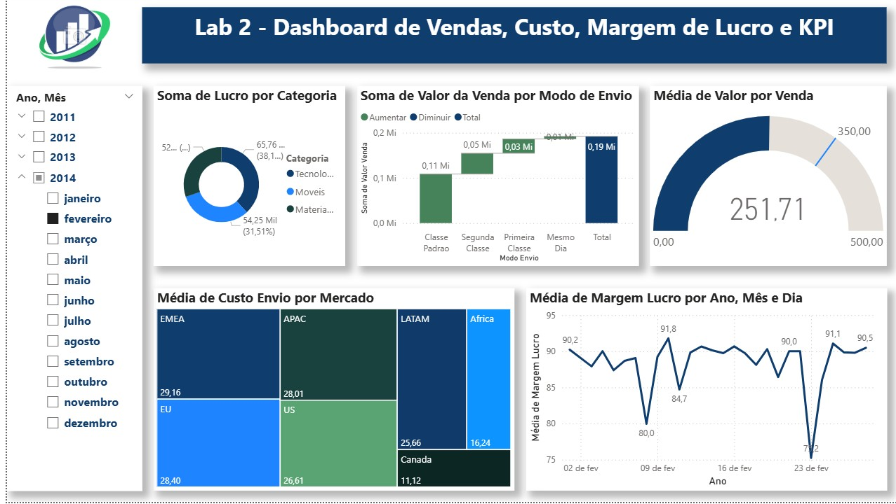

# 📊 Dashboard Comercial | Power BI

📄 [Baixar versão em PDF](./DashboardVendas.pdf)

---

## 🎯 Objetivo

Analisar o comportamento de vendas ao longo do tempo, identificando padrões de faturamento, custos e lucratividade para apoiar decisões estratégicas.

---

## ❓ Perguntas de Negócio

### 1. Qual categoria gera maior lucro?

* A categoria **Tecnologia** apresenta maior participação (~38%)
* Seguida por **Móveis (~31,5%)**

👉 Indica maior rentabilidade em produtos tecnológicos

---

### 2. Qual o impacto do modo de envio nas vendas?

* **Classe Padrão** concentra maior volume (~0,11 Mi)
* Total geral de vendas: ~0,19 Mi

👉 O frete padrão domina o faturamento

---

### 3. Como os custos variam por mercado?

* Maiores custos: **EMEA (~29,16)** e **EU (~28,40)**
* Menores custos: **Canada (~11,12)** e **Africa (~16,24)**

👉 Oportunidade de otimização logística

---

### 4. Qual o ticket médio e a margem de lucro?

* Ticket médio: **~251,71**
* Margem varia entre ~75 e ~92 ao longo do tempo

👉 Oscilações indicam impacto de custos e descontos

---

## 📈 Principais Insights

* Tecnologia lidera em lucratividade
* Custos logísticos variam significativamente por região
* Frete padrão concentra maior volume de vendas
* Margem de lucro apresenta variações ao longo do tempo

---

## 💡 Por que esses indicadores?

Os KPIs foram selecionados para representar os principais pilares do negócio:

* **Receita / Valor de venda** → desempenho comercial
* **Lucro e margem** → rentabilidade
* **Custo de envio** → impacto direto no lucro
* **Modo de envio** → influência operacional
* **Ticket médio** → comportamento de compra

👉 Esses indicadores juntos permitem uma visão completa entre **vendas, custo e lucro**

---

## 📁 Arquivos do Projeto

* `dashboard.pbix` → Arquivo do Power BI
* `dashboard.pdf` → Versão para visualização
* `dashboard.png` → Imagem do dashboard

Projeto desenvolvido com base em estudos do curso de Power BI da Data Science Academy (DSA), com adaptações, análises e interpretações próprias.

---

## 🛠️ Tecnologias Utilizadas

* Power BI
* DAX
* Modelagem em estrela
* Power Query (ETL)

---

## 👨‍💻 Autor

Thiago Sperate 😎
Analista de Dados 📊

📎 [LinkedIn](https://www.linkedin.com/in/thiagosperate/)
📁 [Portfólio](https://github.com/ThSperate)
